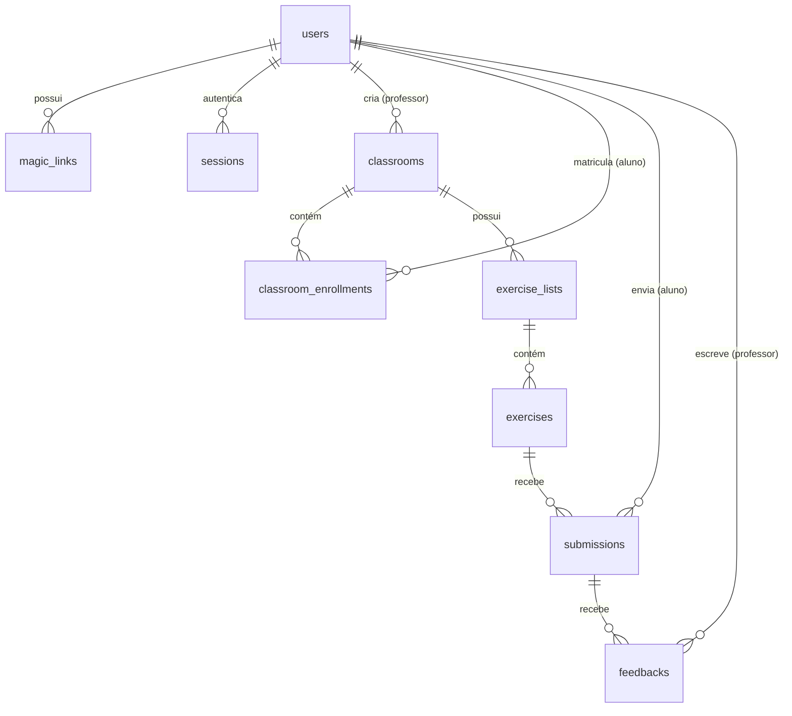

# Modelo do Banco de Dados — CodeLab

Este documento descreve a modelagem relacional do banco de dados projetado para o **Cloudflare D1 (SQLite Serverless)**, atendendo aos requisitos de monitoria acadêmica de Introdução à Programação, autenticação sem senhas (*Magic Link*), turmas com inscrição por PIN de 6 dígitos, listas de exercícios C99, verificação de saída esperada, e submissões com feedback por e-mail.

---

## 1. Visão Geral das Entidades



### 1.1. Descrição dos Campos

* **`users`**: Representa alunos e professores/monitores da disciplina.
  * `id`: Identificador único (UUID v4 / nanoid).
  * `name`: Nome completo do participante.
  * `email`: E-mail institucional ou pessoal (único, usado no Magic Link).
  * `role`: Papel na plataforma (`'aluno'` ou `'professor'`).
  * `created_at`: Data e hora de cadastro.

* **`magic_links`**: Tokens temporários e descartáveis para autenticação.
  * `id`: Identificador único.
  * `user_id`: Chave estrangeira referenciando `users(id)`.
  * `token_hash`: Hash SHA-256 do token criptográfico de 32 bytes enviado por e-mail.
  * `expires_at`: Timestamp de expiração (15 minutos após geração).
  * `used_at`: Timestamp de consumo (uso único).
  * `created_at`: Data e hora de emissão.

* **`sessions`**: Sessões ativas autenticadas via Cookie HttpOnly.
  * `id`: Chave da sessão armazenada no cookie do navegador.
  * `user_id`: Chave estrangeira referenciando `users(id)`.
  * `expires_at`: Validade da sessão (7 dias).
  * `created_at`: Data e hora de criação.

* **`classrooms` (Turmas)**: Salas de aula criadas pelos professores/monitores.
  * `id`: Identificador único.
  * `teacher_id`: Chave estrangeira referenciando `users(id)`.
  * `name`: Nome da turma (ex: "IP - Engenharia de Software 2026.1").
  * `header_image`: URL ou chave R2 da imagem de cabeçalho da turma.
  * `pin`: Código aleatório de 6 números (ex: `481923`) para entrada dos alunos.
  * `created_at`: Data e hora de criação.

* **`classroom_enrollments`**: Matrícula do aluno na turma via PIN.
  * `id`: Identificador único.
  * `classroom_id`: Chave estrangeira referenciando `classrooms(id)`.
  * `student_id`: Chave estrangeira referenciando `users(id)`.
  * `enrolled_at`: Data e hora de matrícula.
  * Restrição: `UNIQUE(classroom_id, student_id)`.

* **`exercise_lists`**: Conjunto temático de exercícios da turma.
  * `id`: Identificador único.
  * `classroom_id`: Chave estrangeira referenciando `classrooms(id)`.
  * `name`: Nome da lista (ex: "Lista 01: Variáveis, printf e scanf").
  * `description`: Orientações pedagógicas e prazos.
  * `order_index`: Posição de ordenação.
  * `created_at`: Data e hora de criação.

* **`exercises`**: Questões de programação C99.
  * `id`: Identificador único.
  * `list_id`: Chave estrangeira referenciando `exercise_lists(id)`.
  * `title`: Título do problema.
  * `description`: Enunciado completo da questão.
  * `initial_code`: Código C99 inicial fornecido como template.
  * `test_input`: Entrada padrão (`stdin`) para alimentar o programa.
  * `expected_output`: Saída esperada (`stdout`) comparada automaticamente na compilação.
  * `video_link`: URL do vídeo de resolução (armazenado no R2 ou link direto).
  * `order_index`: Posição da questão na lista.
  * `created_at`: Data e hora de criação.

* **`submissions`**: Códigos submetidos pelos alunos para correção.
  * `id`: Identificador único.
  * `exercise_id`: Chave estrangeira referenciando `exercises(id)`.
  * `student_id`: Chave estrangeira referenciando `users(id)`.
  * `code`: Código-fonte C99 submetido.
  * `stdin`: Entrada de teste utilizada no momento da submissão.
  * `stdout`: Saída obtida no console.
  * `status`: Resultado da verificação (`'correct'`, `'wrong_answer'`, `'error'`).
  * `submitted_at`: Data e hora do envio.

* **`feedbacks`**: Mensagens de correção e retorno do professor.
  * `id`: Identificador único.
  * `submission_id`: Chave estrangeira referenciando `submissions(id)`.
  * `teacher_id`: Chave estrangeira referenciando `users(id)`.
  * `feedback_text`: Conteúdo textual da orientação técnica/pedagógica.
  * `sent_to_email`: E-mail de destino do aluno.
  * `sent_at`: Data e hora do disparo do e-mail.

---

## 2. Esquema DDL (SQLite / Cloudflare D1)

```sql
-- 1. Usuários
CREATE TABLE IF NOT EXISTS users (
    id TEXT PRIMARY KEY,
    name TEXT NOT NULL,
    email TEXT UNIQUE NOT NULL,
    role TEXT NOT NULL CHECK (role IN ('aluno', 'professor')),
    created_at TEXT NOT NULL DEFAULT (datetime('now'))
);

-- 2. Magic Links
CREATE TABLE IF NOT EXISTS magic_links (
    id TEXT PRIMARY KEY,
    user_id TEXT NOT NULL REFERENCES users(id) ON DELETE CASCADE,
    token_hash TEXT NOT NULL UNIQUE,
    expires_at TEXT NOT NULL,
    used_at TEXT,
    created_at TEXT NOT NULL DEFAULT (datetime('now'))
);

-- 3. Sessões
CREATE TABLE IF NOT EXISTS sessions (
    id TEXT PRIMARY KEY,
    user_id TEXT NOT NULL REFERENCES users(id) ON DELETE CASCADE,
    expires_at TEXT NOT NULL,
    created_at TEXT NOT NULL DEFAULT (datetime('now'))
);

-- 4. Turmas
CREATE TABLE IF NOT EXISTS classrooms (
    id TEXT PRIMARY KEY,
    teacher_id TEXT NOT NULL REFERENCES users(id) ON DELETE CASCADE,
    name TEXT NOT NULL,
    header_image TEXT,
    pin TEXT NOT NULL UNIQUE,
    created_at TEXT NOT NULL DEFAULT (datetime('now'))
);

-- 5. Matrículas em Turmas
CREATE TABLE IF NOT EXISTS classroom_enrollments (
    id TEXT PRIMARY KEY,
    classroom_id TEXT NOT NULL REFERENCES classrooms(id) ON DELETE CASCADE,
    student_id TEXT NOT NULL REFERENCES users(id) ON DELETE CASCADE,
    enrolled_at TEXT NOT NULL DEFAULT (datetime('now')),
    UNIQUE(classroom_id, student_id)
);

-- 6. Listas de Exercícios
CREATE TABLE IF NOT EXISTS exercise_lists (
    id TEXT PRIMARY KEY,
    classroom_id TEXT NOT NULL REFERENCES classrooms(id) ON DELETE CASCADE,
    name TEXT NOT NULL,
    description TEXT,
    order_index INTEGER NOT NULL DEFAULT 0,
    created_at TEXT NOT NULL DEFAULT (datetime('now'))
);

-- 7. Exercícios
CREATE TABLE IF NOT EXISTS exercises (
    id TEXT PRIMARY KEY,
    list_id TEXT NOT NULL REFERENCES exercise_lists(id) ON DELETE CASCADE,
    title TEXT NOT NULL,
    description TEXT NOT NULL,
    initial_code TEXT,
    test_input TEXT,
    expected_output TEXT NOT NULL,
    video_link TEXT,
    order_index INTEGER NOT NULL DEFAULT 0,
    created_at TEXT NOT NULL DEFAULT (datetime('now'))
);

-- 8. Submissões dos Alunos
CREATE TABLE IF NOT EXISTS submissions (
    id TEXT PRIMARY KEY,
    exercise_id TEXT NOT NULL REFERENCES exercises(id) ON DELETE CASCADE,
    student_id TEXT NOT NULL REFERENCES users(id) ON DELETE CASCADE,
    code TEXT NOT NULL,
    stdin TEXT,
    stdout TEXT,
    status TEXT NOT NULL CHECK (status IN ('correct', 'wrong_answer', 'error')),
    submitted_at TEXT NOT NULL DEFAULT (datetime('now'))
);

-- 9. Feedbacks do Professor
CREATE TABLE IF NOT EXISTS feedbacks (
    id TEXT PRIMARY KEY,
    submission_id TEXT NOT NULL REFERENCES submissions(id) ON DELETE CASCADE,
    teacher_id TEXT NOT NULL REFERENCES users(id) ON DELETE CASCADE,
    feedback_text TEXT NOT NULL,
    sent_to_email TEXT NOT NULL,
    sent_at TEXT NOT NULL DEFAULT (datetime('now'))
);

-- Índices de Alta Eficiência
CREATE INDEX IF NOT EXISTS idx_users_email ON users(email);
CREATE INDEX IF NOT EXISTS idx_magic_links_hash ON magic_links(token_hash);
CREATE INDEX IF NOT EXISTS idx_classrooms_pin ON classrooms(pin);
CREATE INDEX IF NOT EXISTS idx_classroom_enrollments_student ON classroom_enrollments(student_id);
CREATE INDEX IF NOT EXISTS idx_exercise_lists_classroom ON exercise_lists(classroom_id);
CREATE INDEX IF NOT EXISTS idx_exercises_list ON exercises(list_id);
CREATE INDEX IF NOT EXISTS idx_submissions_exercise ON submissions(exercise_id);
CREATE INDEX IF NOT EXISTS idx_submissions_student ON submissions(student_id);
CREATE UNIQUE INDEX IF NOT EXISTS idx_submissions_student_exercise ON submissions(student_id, exercise_id);
```

---

## 3. Detalhamento e Decisões de Arquitetura

1. **Validação Instantânea de Código**: A coluna `expected_output` armazena a saída esperada. O comparador cliente-servidor executa a normalização (`actual.trim() === expected.trim()`), garantindo retorno instantâneo no navegador do aluno.
2. **Entrada de Teste Integrada (`test_input`)**: Para programas que utilizam `scanf`, a coluna `test_input` fornece os dados automáticos de alimentação do fluxo de entrada padrão, eliminando falhas por leitura vazia.
3. **Imagens e Vídeos no R2**: As colunas `header_image` e `video_link` guardam apenas os apontamentos das chaves do Cloudflare R2 ou URLs públicas, mantendo o banco D1 leve e estritamente relacional.
4. **Isolamento de Turmas por PIN**: O PIN de 6 números atua como chave de acesso rápido, permitindo que alunos se inscrevam sem atrito em sala de aula.
