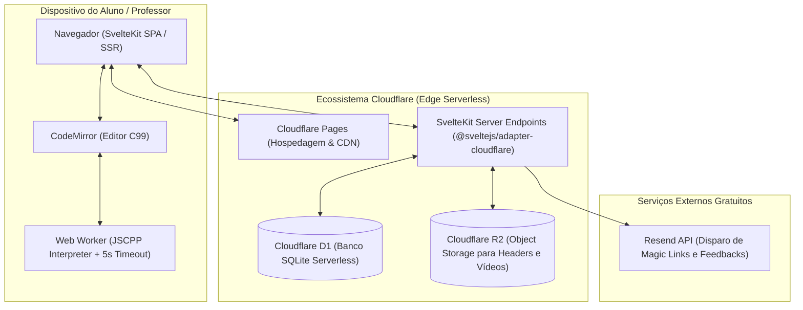
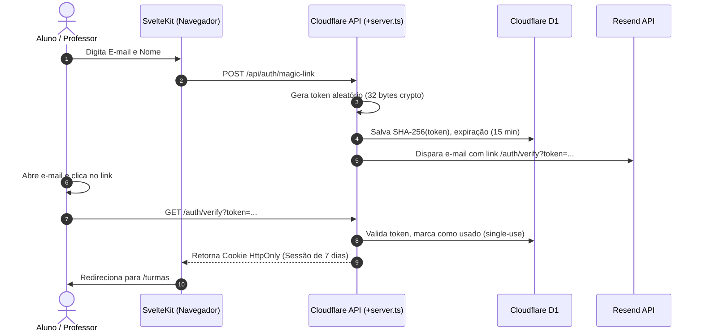

# Stack Bible — CodeLab

Este documento formaliza as decisões de arquitetura e tecnologia adotadas no **CodeLab**. O objetivo primordial é manter o projeto com o **menor custo operacional possível (R$ 0,00)**, **zero servidores dedicados para compilar código C**, **execução segura no navegador do aluno via Web Worker**, **carregamento ultrarrápido** e **alta facilidade de manutenção**.

---

## 1. Visão Geral da Arquitetura



---

## 2. Matriz de Tecnologias

| Camada | Tecnologia | Pacote / Versão | Justificativa |
| :--- | :--- | :--- | :--- |
| **Framework Fullstack** | SvelteKit | `svelte@^5`, `@sveltejs/kit@^2` | Compilação ultraleve, reatividade nativa e rotas SSR/API unificadas. |
| **Adaptador Cloudflare** | Cloudflare Adapter | `@sveltejs/adapter-cloudflare` | Integração nativa com Pages Functions, D1 e R2 via contexto `platform.env`. |
| **Banco de Dados** | Cloudflare D1 | Nativo (SQLite) | Banco relacional serverless, gratuito, sem gerenciamento de portas ou infraestrutura. |
| **Armazenamento de Arquivos** | Cloudflare R2 | Nativo (S3-compatible) | Armazena imagens de cabeçalho de turmas e vídeos de resoluções sem custo de egress. |
| **Compilador/Executor C** | JSCPP + Web Worker | Local (`/static/lib/JSCPP.es5.min.js`) | Executa C99 diretamente no navegador do aluno com timeout de segurança, custo zero de servidor. |
| **Editor de Código** | CodeMirror 5 | Local (`/static/lib/codemirror.min.js`) | Modo C/C++, tema Dracula, fechamento de chaves e indentação configurada. |
| **Estilização** | Tailwind CSS | `tailwindcss@^3.4` | CSS utilitário enxuto, tipografia editorial e hairlines anti-card. |
| **Disparo Transacional** | Resend | Chamada nativa `fetch` | Envio de Magic Links e feedbacks diretamente para o e-mail dos alunos. |

---

## 3. Separação de Variáveis: Segredos (.env) vs. Públicas (wrangler.toml)

Para garantir segurança máxima e conformidade com as boas práticas:

### 3.1. Segredos em `.env` (Arquivo local, nunca comitado)
* `RESEND_API_KEY`: Token de autorização para envio de e-mails via Resend.
* `AUTH_SECRET`: Chave secreta criptográfica para assinatura de cookies ou tokens.
* `R2_ACCESS_KEY_ID` / `R2_SECRET_ACCESS_KEY`: Chaves de acesso S3 para R2 (se necessárias fora do runtime da Cloudflare).

### 3.2. Variáveis Públicas / Configurações em `wrangler.toml`
* `APP_URL = "https://codelab.pages.dev"`
* `PIN_LENGTH = "6"`
* `RESEND_FROM_EMAIL = "CodeLab <onboarding@resend.dev>"`
* Bindings de infraestrutura:
  * `[[d1_databases]]`: binding `DB`
  * `[[r2_buckets]]`: binding `R2`

---

## 4. Backend: Cloudflare Edge Runtime

Toda a lógica de backend opera diretamente nas **Cloudflare Pages Functions** através do `@sveltejs/adapter-cloudflare`.

### 4.1. Acesso aos Recursos Cloudflare no SvelteKit
No servidor (`+server.ts` ou `+page.server.ts`), os serviços são acessados diretamente através do contexto da plataforma:
```typescript
import type { RequestHandler } from './$types';

export const POST: RequestHandler = async ({ request, platform }) => {
  const db = platform?.env.DB; // Instância do Cloudflare D1
  const r2 = platform?.env.R2; // Bucket do Cloudflare R2
  
  // Queries SQL preparadas nativas e seguras contra injeção SQL
  const result = await db.prepare('SELECT * FROM exercises WHERE id = ?').bind(exerciseId).first();
  
  return new Response(JSON.stringify(result), { headers: { 'Content-Type': 'application/json' } });
};
```

---

## 5. Autenticação: Magic Links & Sessões

A autenticação é unificada para Alunos e Professores, eliminando senhas:



### Regras de Segurança do Cookie de Sessão:
* `HttpOnly: true` (inalcançável via scripts maliciosos no navegador / anti-XSS).
* `Secure: true` (trafega exclusivamente sobre HTTPS em produção).
* `SameSite: Lax` (proteção nativa contra ataques CSRF).

---

## 6. Motor C99 Client-Side (Custo Zero de Servidor)

1. **Interpretação Segura via Web Worker**:
   - O código C99 do aluno é executado dentro de um Web Worker isolado rodando `JSCPP.es5.min.js`.
   - Limite de tempo estrito de **5 segundos**: protege contra loops infinitos (`while(1)`) e recursões descontroladas sem travar o navegador.
2. **Entrada e Saída (`stdin` / `stdout`)**:
   - `stdin` é alimentado pelo textarea dedicado para atender a chamadas `scanf()`.
   - `stdout` e `stderr` são capturados evento por evento e exibidos no terminal.
3. **Verificação Automática com Saída Esperada**:
   - Comparação direta:
     ```typescript
     const isCorrect = output.trim() === expectedOutput.trim();
     ```
   - O resultado (`correct` ou `wrong_answer`) é sinalizado na interface e registrado na submissão.

---

## 7. Estrutura de Diretórios da Aplicação

```
Codelab/
├── .agents/                        # Documentação viva do projeto
├── migrations/                     # Scripts SQL para o Cloudflare D1
│   └── 0001_initial_schema.sql
├── static/                         # Assets estáticos (ícones pixelados, logo, favicon)
│   ├── icons/                      # Biblioteca de ícones (pasta, livro, pessoas, etc.)
│   └── lib/                        # CodeMirror, JSCPP e estilos locais
├── src/
│   ├── app.html
│   ├── app.d.ts
│   ├── app.css                     # Tailwind e variáveis do tema editorial
│   ├── lib/
│   │   ├── components/             # Componentes Svelte (Header, Editor, Terminal, Modais)
│   │   ├── server/                 # Lógica de servidor (auth, db, email, r2)
│   │   └── utils/
│   └── routes/
│       ├── +layout.svelte          # Shell comum com navegação e perfil
│       ├── +page.svelte            # Landing page
│       ├── auth/                   # Telas de login e verificação
│       ├── turmas/                 # Seleção e matrícula por PIN de 6 dígitos
│       ├── turmas/[turmaId]/lista/[listaId]/ # Workspace de 2 colunas do aluno
│       ├── professor/              # Gestão de turmas e listas do professor
│       └── professor/exercicio/[id]/ # Edição, submissões e feedbacks
├── svelte.config.js                # Adaptador Cloudflare Pages
├── tailwind.config.ts              # Variáveis e fontes
├── vite.config.ts                  # Bundler Vite
└── wrangler.toml                   # Configuração Cloudflare, bindings e vars públicas
```